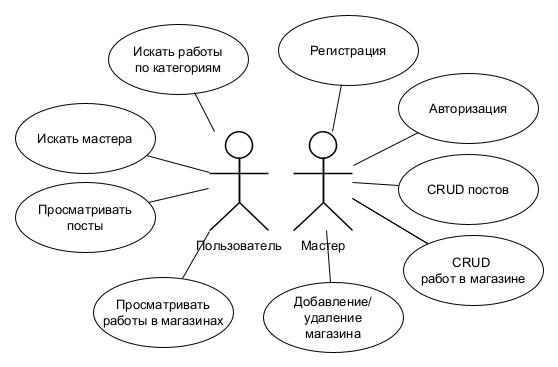
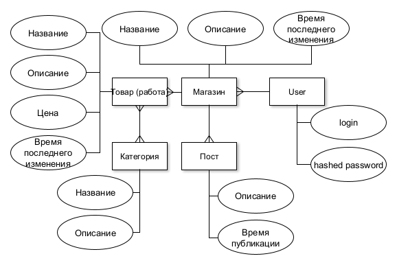
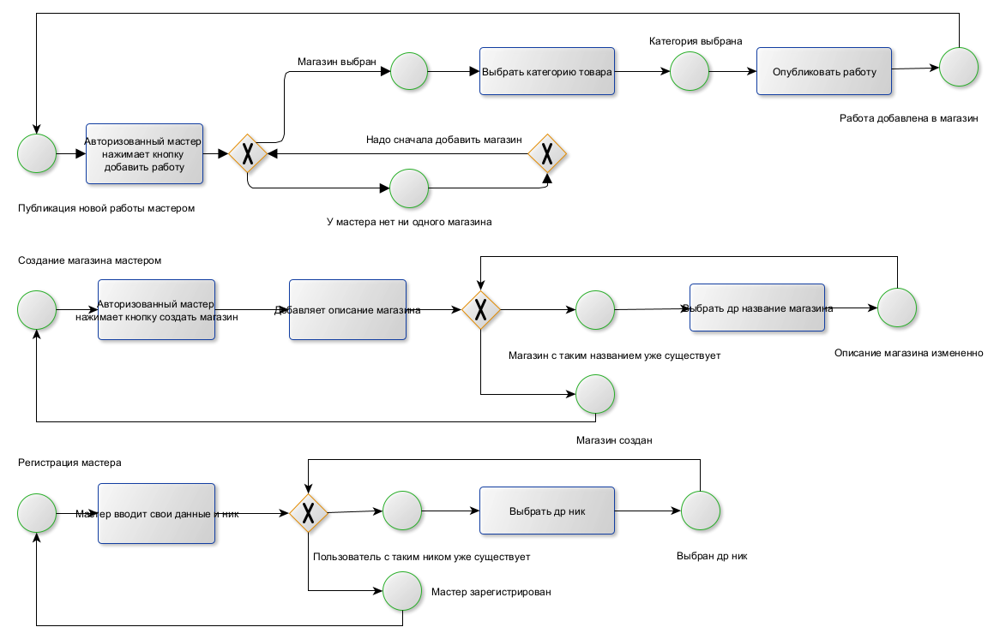
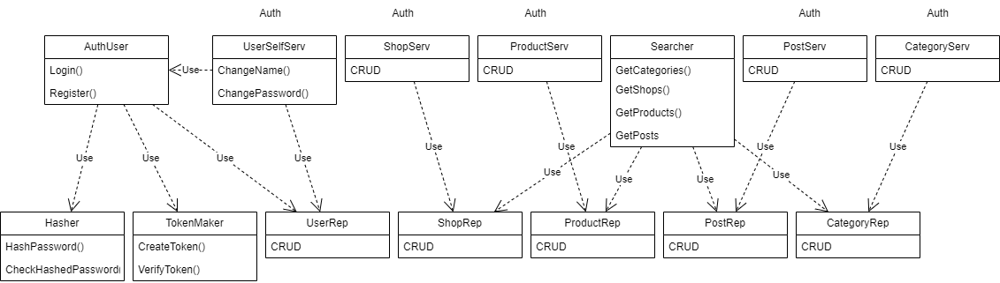
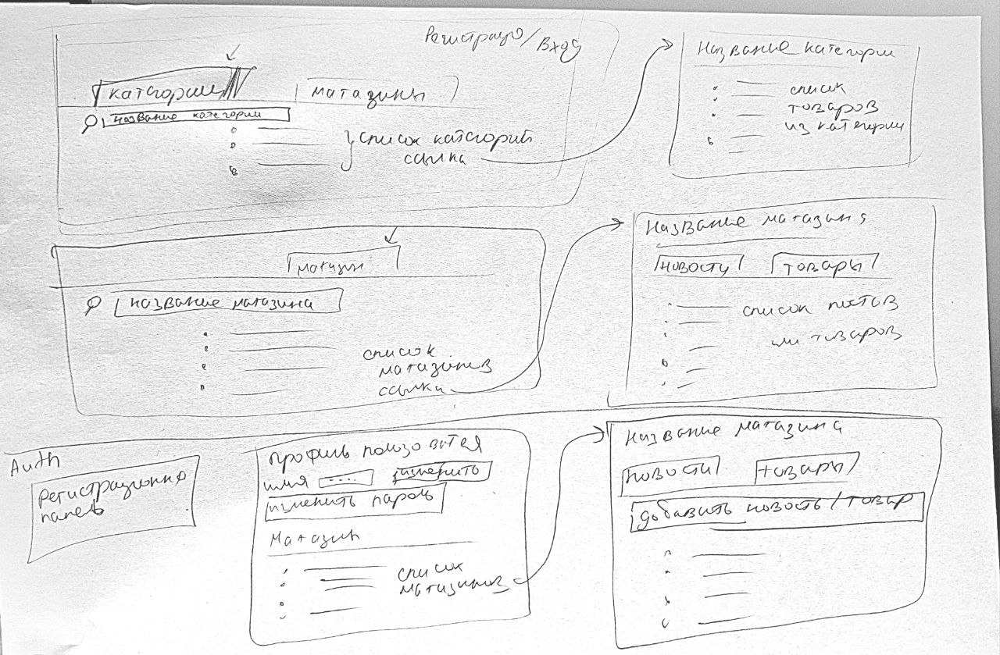

## Название проекта
Платформа для мастеров ручной работы

## Описание идеи проекта
Создать централизованную платформу, где мастера могут создать свое портфолио, а покупатели — открывать для себя уникальные товары и напрямую связываться с создателями.

## Описание акторов (ролей)

**Мастер** может создать свой магазин, создавать посты о своих работах, в своем портфолио указывать список своих работ(товаров) и свои соц сети для связи с покупателем.

**Пользователь**, может смотреть посты, по категориям и искать мастеров.

## Стек
Docker Compose, Nginx, gRPC, REST API, Go, JWT, Swagger, Postgres

## Use-Case - диаграмма

## ER-диаграмма сущностей

## 10. Формализация ключевых бизнес-процессов (BPMN-нотация).

## Верхнеуровневое разбиение на компоненты

## Черновик интерфейса

## Документация (Swagger)
[swagger.yaml](./docs/swagger.yaml)

[http://localhost/swagger/index.html](http://localhost/swagger/index.html)

Loki: http://loki_craftplace:3100

# Nginx Configuration Paths for README.md

## Основные маршруты приложения

### 📍 Статические файлы и основной интерфейс
- **`/`** - Главная страница (статический контент)
- **`/status`** - Страница статуса сервиса
- **`/documentation`** - Документация проекта
- **`/managment`** - Панель управления

### 📚 Документация API
- **`/swagger/`** → Primary Backend
  - Swagger документация основного API
- **`/mirror/swagger/`** → Mirror Backend
  - Swagger документация mirror API

#### Администрирование БД
- **`/admin/`** → pgAdmin
  - Веб-интерфейс для управления PostgreSQL
### 🔄 Mirror API
- **`/mirror/api/v1/`** → Mirror Backend
  - Тестовое/зеркальное API для разработки

  
