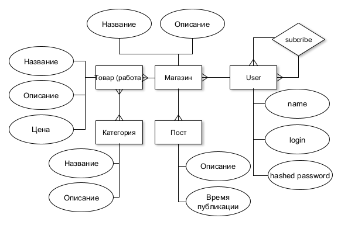

## Название проекта
Платформа для мастеров ручной работы

## Описание идеи проекта
Создать централизованную платформу, где мастера могут создать свое портфолио, а покупатели — открывать для себя уникальные товары и напрямую связываться с создателями.

<!-- ## 4. Краткий анализ аналогичных решений по минимум 3 критериям (1 таблица); -->

## Краткое обоснование целесообразности и актуальности проекта (1 абзац)
Создание системы учета экспонатов находящихся в небольших частных коллекциях и распространения информации об их участии в сторонних выставках. С возможностью подписки на рассылку о новых выставках. 

## Краткое описание акторов (ролей)

**Мастер** может создать свой магазин, создавать посты о своих работах, в своем портфолио указывать список своих работ(товаров) и свои соц сети для связи с покупателем.

**Пользователь**, может смотреть посты, по категориям и искать мастеров.

## Стек
 | Компонент               | Технологии/Инструменты         |
|-------------------------|--------------------------------|
| Язык                    | **Go**                             |
| Контейнеризация         | **Docker, Docker Compose**         |
| Веб-фреймворк           | **Gin**                            |
| Построение SQL-запросов | **Squirrel**                       |
| Аутентификация          | Токены (**PASETO/JWT**, гибкость)  |
| БД                      | **PostgreSQL**                     |
| Миграции БД             | **golang-migrate** |
| Frontend                | Web MPA (HTML-шаблоны через **Go Templ**) |
| Тестирование            | **Ozontech**                       |
| Документация и тесты    | **Swagger** (генерация через go-swagger) |

## Use-Case - диаграмма

## ER-диаграмма сущностей

## 10. Формализация ключевых бизнес-процессов (BPMN-нотация).

## Верхнеуровневое разбиение на компоненты

## Черновик интерфейса

  
